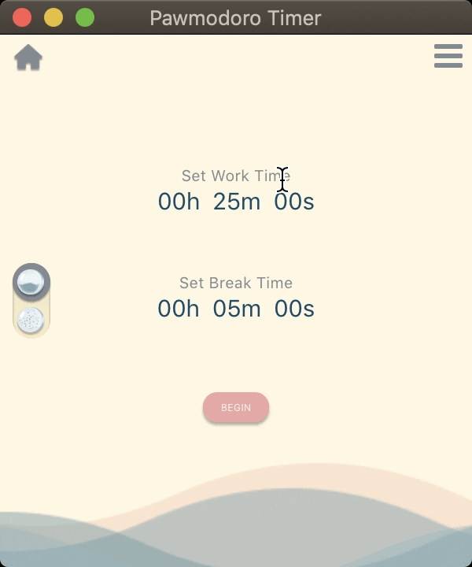
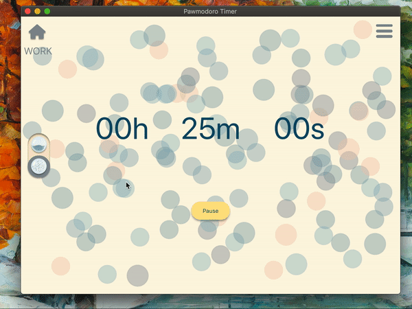
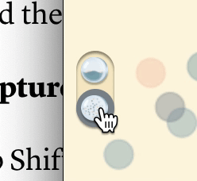

<!--  -->

A chill little pomodoro timer that reflects countdowns visually via animations (a rising tide, or disappearing bubbles of light). Users can customize the length of time to work and break for; the timer automatically switches between work and break sessions for you.

## Features
<!-- --- -->

### Animations

 

Animations sync to the amount of time left on the countdown, serving as a dynamic indicator of countdown progress. Integration into React done using CSS, requestAnimationFrame, and Canvas.

### Interactive Elements

 

Easy to use interfaces allow users to personlize timer settings, and adjust the length of work and break intervals midway through the countdown. Component placement done via CSS grid and CSS flexbox.   

### Self-designed Static Assets

Static assets coded from scratch, allowing for greater customizability. Designs created using Figma and incorporated into CSS checkboxes and radio buttons. 

