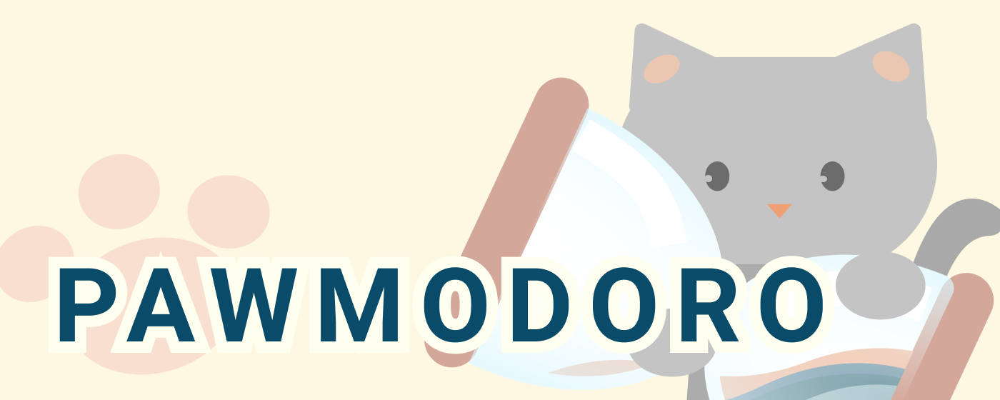

<!--  -->

A chill little pomodoro timer that reflects countdowns visually via animations (a rising tide, or disappearing bubbles of light). 

## Features
<!-- --- -->

### Animations

 

    Timer Input - 
    <GIF here>
    - flexbox
    - add time

    Animation:
    Waves
    <GIF here>
    - pure css

    Light Dots 
    <GIF here>
    - request animation frame
    - canvas

    
    Animation Toggle:
    - radio button
    - labels of radio buttons are drawn in Figma

    

